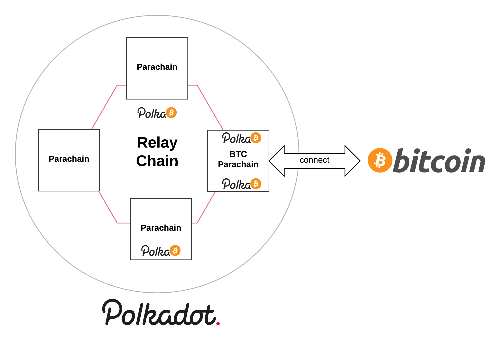

# BTC Parachain

This is a proof of concept implementation of a BTC Parachain to bring Bitcoin into the Polkadot universe.
It allows the creation of **PolkaBTC**, a fungible token that represents Bitcoin in the Polkadot ecosystem.
PolkaBTC is backed by Bitcoin 1:1 and allows redeeming of the equivalent amount of Bitcoins by relying on a collateralized third-party.

The project uses the concept of [Cryptocurrency-backed Assets](https://xclaim.io) to lock Bitcoin on the Bitcoin blockchain and issue BTC-backed tokens on the BTC Parachain.
The implementation is based on the [BTC Parachain specification](https://interlay.gitlab.io/polkabtc-spec/).

