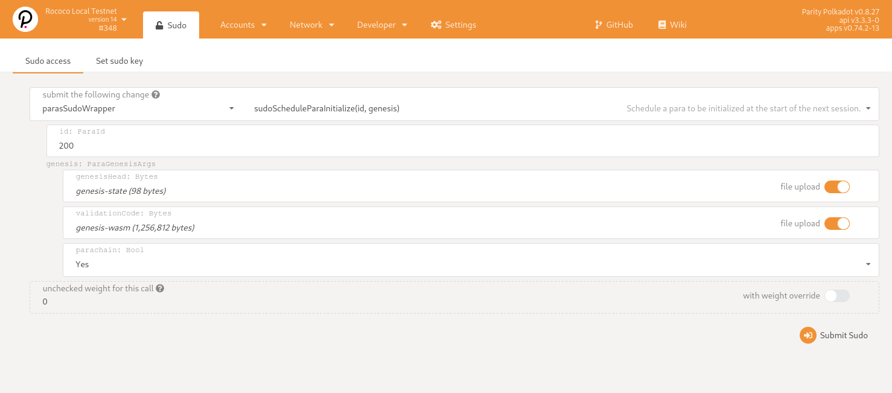
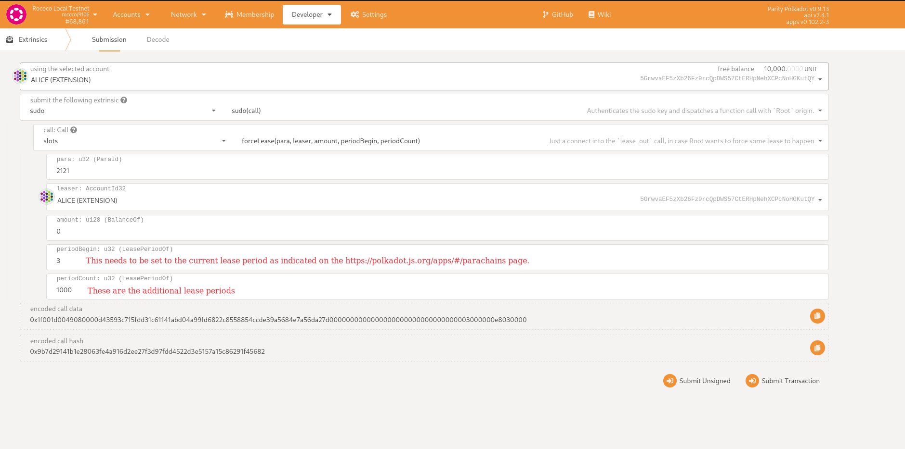

# Rococo - Local (Automated Setup, Recommended)

Install [polkadot-launch](https://github.com/paritytech/polkadot-launch).

```
## Manual
git clone https://github.com/paritytech/polkadot-launch.git
cd polkadot-launch
yarn global add file:$(pwd)

## Automatic
yarn global add polkadot-launch
```

Compile and install [polkadot](https://github.com/paritytech/polkadot).

```shell
git clone git@github.com:paritytech/polkadot.git
cd polkadot
git checkout release-v0.9.16

cargo build --release
sudo cp ./target/release/polkadot /usr/local/bin/
```

Compile and install the [parachain](https://github.com/interlay/interbtc).

```shell
git clone git@github.com:interlay/interbtc.git
cd interbtc

cargo build --release --bin interbtc-parachain --features rococo-native
sudo cp ./target/release/interbtc-parachain /usr/local/bin/
```

Run polkadot-launch. We provide two configurations: one to start a [single parachain](./rococo-local.json), and one that sets up [two parachains](rococo-local-xcm.json) that can be used for testing xcm communication.

```shell
polkadot-launch ./docs/rococo-local-xcm.json
# or..
polkadot-launch ./docs/rococo-local.json
```

# Rococo - Local (Manual Setup, Not Recommended)

## Relay Chain

Compile and install polkadot as above.

```shell
# Generate chain spec
polkadot build-spec --chain rococo-local --disable-default-bootnode --raw > rococo-local.json

# Run 1st validator
polkadot --chain rococo-local.json --alice --tmp --discover-local

# Run 2nd validator
polkadot --chain rococo-local.json --bob --tmp --discover-local --port 30334
```

## Parachain

Compile and install the parachain as above.

```shell
# Export the chain spec
interbtc-parachain build-spec --chain rococo-local-2000 --raw > rococo-spec.json

# Export genesis state (using reserved paraid)
interbtc-parachain export-genesis-state --chain rococo-spec.json > genesis-state

# Export genesis wasm
interbtc-parachain export-genesis-wasm --chain rococo-spec.json > genesis-wasm

# Run parachain collator
interbtc-parachain \
    --alice \
    --collator \
    --force-authoring \
    --chain=rococo-spec.json \
    --port 40335 \
    --ws-port 9946 \
    --discover-local \
    --tmp \
    --execution wasm \
    -- \
    --execution wasm \
    --chain rococo-local.json \
    --port 30335 \
    --discover-local
```

## Register

To register the parachain, you can use the [Polkadot JS Apps UI](https://polkadot.js.org/apps/#/?rpc=ws://localhost:9944).



Before sending messages between parachains you must first establish a channel.


Add the [types](https://github.com/interlay/interbtc-types) to the developer settings if the app fails to decode any responses.


## Extend the lease period

By default the lease period of the parachain is a bit more than 1 day. For a longer running test network, we want to have longer lease periods otherwise the parachain is demoted to a parathread after 1 day.

Use sudo to extend the lease period:


