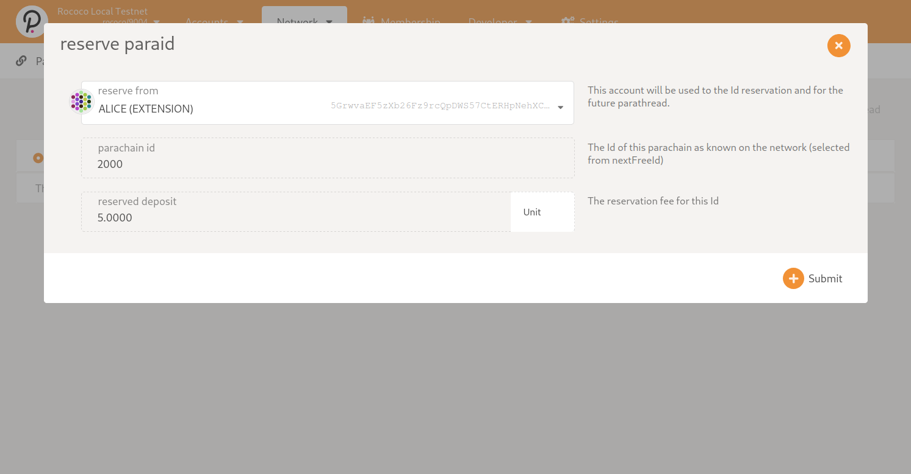
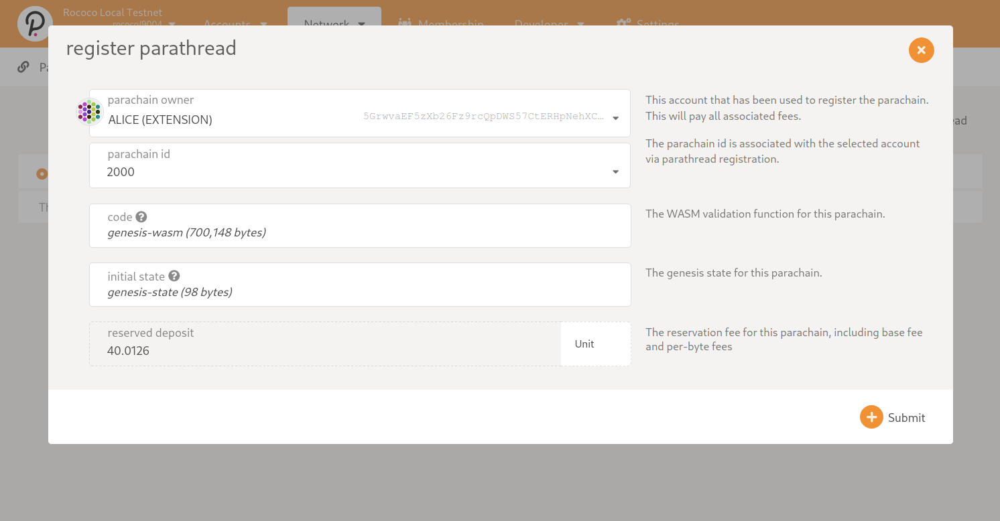
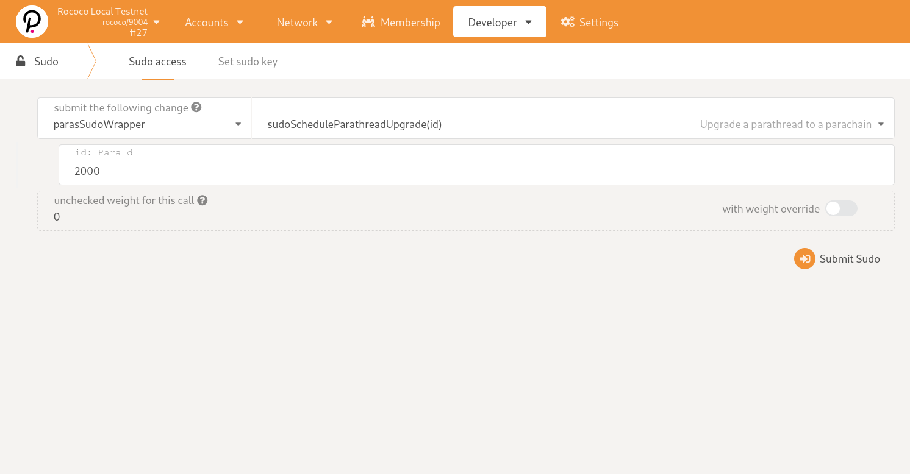
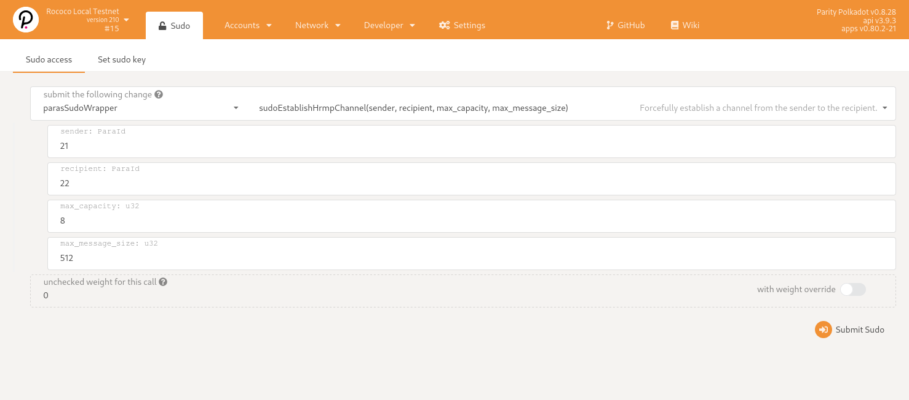

# Rococo - Local (Automated Setup)

Install [polkadot-launch](https://github.com/paritytech/polkadot-launch).

```
git clone https://github.com/paritytech/polkadot-launch.git
cd polkadot-launch
yarn global add file:$(pwd)
```

Compile and install [polkadot](https://github.com/paritytech/polkadot).

```shell
git clone git@github.com:paritytech/polkadot.git
cd polkadot
git checkout v0.9.8

cargo build --release
sudo cp ./target/release/polkadot /usr/local/bin/
```

Compile and install the [parachain](https://github.com/interlay/interbtc).

```shell
git clone git@github.com:interlay/interbtc.git
cd interbtc

cargo build --release --bin interbtc-parachain --features rococo-native
sudo cp ./target/release/interbtc-parachain /usr/local/bin/
```

Run polkadot-launch with [this config](./xcm-config.json).

```shell
polkadot-launch ./docs/xcm-config.json
```

# Rococo - Local (Manual Setup)

## Relay Chain

Compile and install polkadot as above.

```shell
# Generate chain spec
polkadot build-spec --chain rococo-local --disable-default-bootnode --raw > rococo-local.json

# Run 1st validator
polkadot --chain rococo-local.json --alice --tmp --discover-local

# Run 2nd validator
polkadot --chain rococo-local.json --bob --tmp --discover-local --port 30334
```

## Parachain

Compile and install the parachain as above.

```shell
# Export genesis state (using reserved paraid)
interbtc-parachain export-genesis-state --chain rococo-local --parachain-id 2000 > genesis-state

# Export genesis wasm
interbtc-parachain export-genesis-wasm > genesis-wasm

# Run parachain collator
interbtc-parachain \
    --alice \
    --collator \
    --force-authoring \
    --parachain-id 2000 \
    --port 40335 \
    --ws-port 9946 \
    --discover-local \
    --tmp \
    -- \
    --execution wasm \
    --chain rococo-local.json \
    --port 30335 \
    --discover-local
```

## Register

To register the Parachain, you can use the [Polkadot JS Apps UI](https://polkadot.js.org/apps/#/?rpc=ws://localhost:9944).







Add the [types](./types.json) to the developer settings if the app fails to decode any responses.

Before sending messages between parachains you must first establish a channel.


