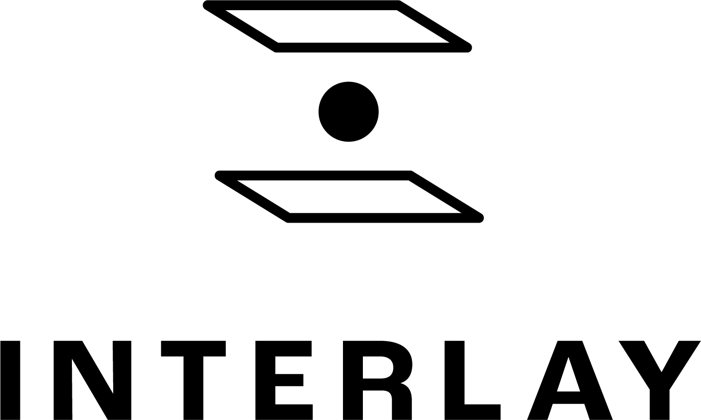

Interlay
========

[Interlay](https://interlay.io) envisions a future where permissioned
and permissionless blockchains, regardless of design and purpose, can
seamlessly connect and interact. From DeFi loans to decentralized
exchanges, from layer-2 protocols to application-specific ledgers:
anyone should use any digital currency on any blockchain platform.

Interlay is co-founded by Imperial College London researchers [Alexei
Zamyatin](https://alexeizamyatin.me) and [Dominik
Harz](https://dominikharz.me), who have been contributing cutting edge
research to the blockchain space for multiple years: from identifying
centralization issues in merged mining, over off-chain computations and
cross-chain bribing, to attacks against DeFi protocols.

Since the invention of XCLAIM in 2018, the team has been busy making the
framework even more secure via more robust cryptographic primitives,
scalable via payment channels and usable by reducing collateral
requirements.

