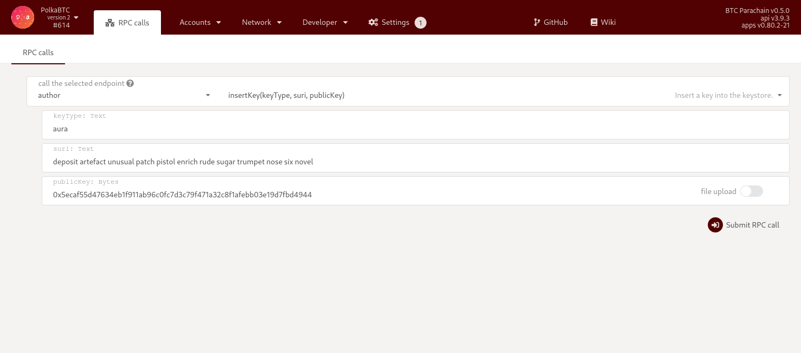

# Subkey

```shell
# install subkey
cargo install --force subkey --git https://github.com/paritytech/substrate --version 2.0.0 --locked

# create random account
subkey generate

# export aura key
subkey inspect --scheme sr25519 <uri>

# export grandpa key
subkey inspect --scheme ed25519 <uri>
```

Import Aura & Grandpa keys into the validator node and restart.


